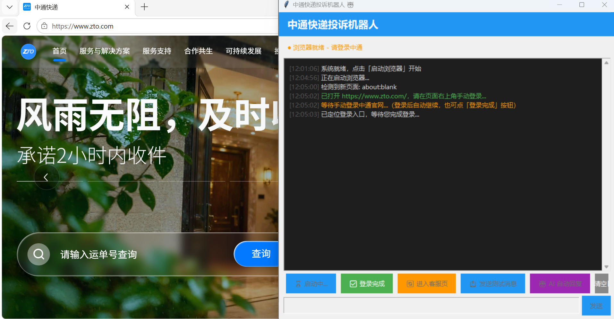
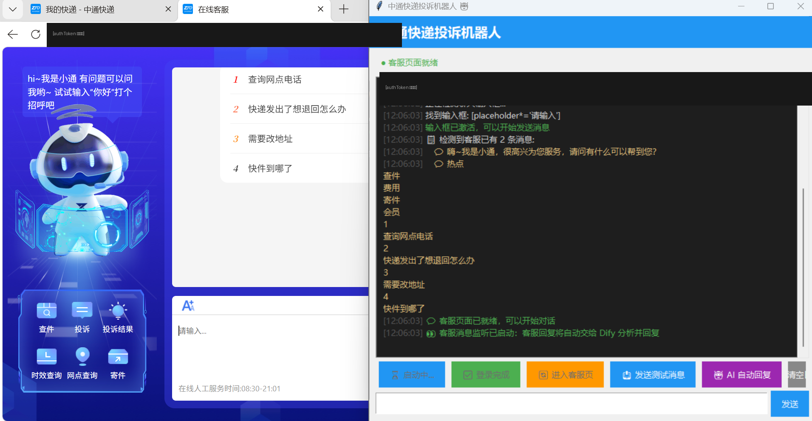
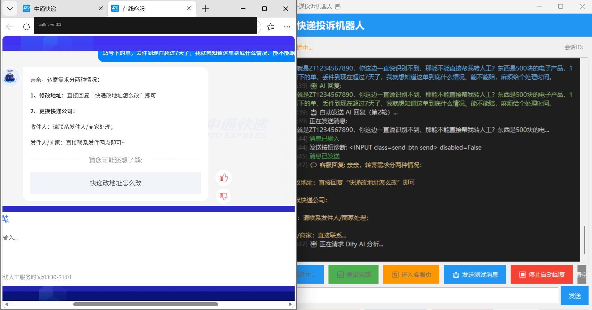

# 中通快递投诉自动化机器人

面向快递投诉场景的 AI Agent：自动与快递在线客服多轮沟通（追进度、索要赔偿），解决"投诉流程长、人工盯不住、易被模板化敷衍"的痛点。

## 这是什么

一套**无人值守的投诉自动化系统**，核心能力：

- **自动多轮沟通**：读取客服回复 → LLM 分析决策 → 生成/检索回复 → 自动发送，循环直至问题解决
- **决策—知识—执行三层解耦**：
  - **决策层**（DeepSeek）：分析客服每条回复，输出结构化 JSON 决策（查知识库 / 直接回复 / 问题是否已解决）
  - **知识层**（Dify Workflow + RAG）：检索赔付条款，结合运单号、金额等投诉信息生成口语化追责回复
  - **执行层**（Playwright + Edge）：驱动浏览器完成消息读取、发送、回复监听
- **可靠性设计**：LLM 结构化输出多层解析校验、多级降级兜底链、防死锁状态机（轮次上限 / 重复回复检测 / 提前终止 / 话术自动升级）

## 架构图

```
┌─────────────────────────────────────────────────────────────┐
│                        执行层 (Playwright)                    │
│   Edge 浏览器：消息监听 ──► 自动发送 ──► 输入框清空校验        │
└───────────────┬─────────────────────────────▲───────────────┘
                │ 客服回复                      │ 回复内容
                ▼                             │
┌─────────────────────────────────────────────────────────────┐
│                        决策层 (DeepSeek)                      │
│   分析客服回复 + 历史对话 ──► JSON {action, reason, resolved} │
└───────────────┬─────────────────────────────▲───────────────┘
                │ action=query_kb              │ 口语化回复
                ▼                             │
┌─────────────────────────────────────────────────────────────┐
│                    知识层 (Dify Workflow)                     │
│   RAG 检索赔付条款 ──► LLM 结合投诉信息生成回复                │
└─────────────────────────────────────────────────────────────┘
        降级链：决策失败→直接回复 │ 工作流失败→DeepSeek兜底 │ 全失败→本地规则
```

## 效果展示

**① 启动浏览器与登录引导** —— 启动后自动打开中通官网并定位登录入口，GUI 实时输出流程日志，登录后一键继续：



**② 进入客服页，AI 自动回复就绪** —— 直达在线客服页，自动检测聊天输入框与客服消息（已识别 2 条），启动 AI 自动回复，客服回复将转交 Dify 分析并生成回复：



**③ 真实对话实战** —— 自动发送追责话术并以"输入框清空"校验送达成功，实时解析客服回复（含按钮诊断），交由 Dify 分析下一轮应答策略：



## 目录结构

```
├── zto_bot/           # 版本一：单体架构 + 自建本地 RAG（LangChain + bge + Chroma + 重排序）
│   ├── main.py            # Tkinter GUI 主程序
│   ├── rag_system/        # 自建 RAG 模块（分块/向量库/问答/重排序）
│   └── config.py
└── complaint_bot/     # 版本二：三层解耦架构（当前主力）
    ├── bot.py             # 决策层 + 调度主循环
    ├── browser.py         # 执行层（Playwright）
    ├── mock_server.py     # Flask 模拟客服，用于多轮剧本回归测试
    └── config.py
```

## 怎么跑

### 环境准备

```bash
# Python 3.10+，安装依赖
pip install playwright requests flask
playwright install msedge   # 或使用本地已装的 Edge

# zto_bot 的 RAG 模块另需
pip install chromadb sentence-transformers langchain langchain-text-splitters
```

### 配置密钥（不会提交到仓库）

```bash
# 1. 复制模板
copy complaint_bot\.env.example complaint_bot\.env
copy zto_bot\.env.example zto_bot\.env

# 2. 填入真实值
#    DEEPSEEK_API_KEY  → https://platform.deepseek.com 申请
#    DIFY_API_KEY      → 本地 Dify 应用的 API Key
#    KF_FULL_URL(zto_bot) → 登录中通官网后复制客服页完整地址（约2小时有效）
```

### 运行

```bash
# 方式一：本地模拟测试（推荐先跑这个，无需真实客服页面）
python complaint_bot/mock_server.py          # 终端1：启动模拟客服 (localhost:5001)
python complaint_bot/bot.py                  # 终端2：启动机器人

# 方式二：真实中通客服页面（需在 .env 配置 KF_FULL_URL）
python zto_bot/main.py                       # 图形界面版
```

## 安全说明

- 所有密钥、含 authToken 的地址均通过 `.env` 加载，`.gitignore` 已排除
- 运行日志包含真实客服对话，仅保留在本地，不入库
